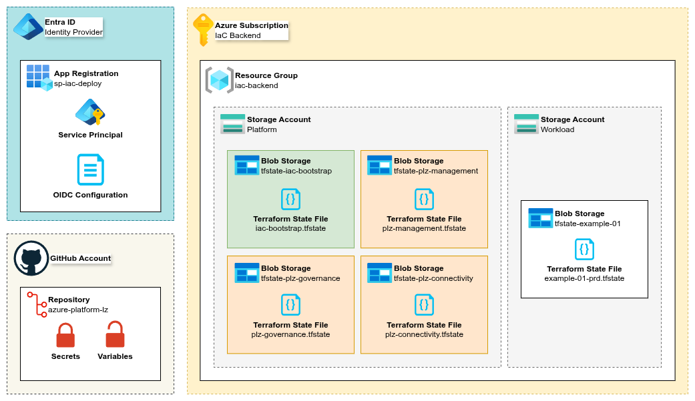

# Bootstrap: Azure & GitHub for Terraform IaC

Automates the **initial bootstrapping** process of both Azure and GitHub, in preparation for executing platform landing zone deployment workflows.

- Locally executed Powershell script performs the initial setup process, configuring Azure and GitHub for automation.
  - Performs pre-flight checks, validates authentication and confirms intentions.
- Executes pre-defined Terraform module to deploy base resources.
- Creates Entra ID Service Principal:
  - Secured with Federated Credentials (OIDC) for GitHub repository and environments.
  - Custom RBAC role assigned at core management group level.
- Deploys backend resources **per stack** into a dedicated IaC subscription:
  - Global Resource Group with dedicated Storage Accounts per category (platform, workloads).
  - Maintaining isolation and independence, using separate state files per stack (governance, connectivity, management).
- Adds stack variables and secrets into the provided GitHub repository.
- Automates the post-deployment migration process of local state file to Azure blob storage providing remote state.

---

## Architecture



---

## 📦 Requirements

- GitHub account with a existing repository for the Azure platform landing zone project.
  - **Roles:** Read/Write access to `actions`, `actions variables`, `administration`, `code`, `environments`, and `secrets`.
- Existing Azure tenant with a _dedicated_ IaC subscription (can also use single `platform` subscription).
- **Built-in Roles:**
  - `Global Administrator` (preferred): Required to approve MSGraph application API permissions assigned to the Service Principal.
  - `Contributor`: Required to deploy initial resources.
  - `User Access Administrator`: Required to assign RBAC roles.
- Applications (installed locally):
  - **[Terraform](https://developer.hashicorp.com/terraform/install):** IaC tool used to deploy resources into the target Azure and GitHub tenancies.
  - **[Azure CLI](https://learn.microsoft.com/en-us/cli/azure/?view=azure-cli-latest):** CLI tool required by Terraform provider (`AzureRM`) to connect to Azure.
  - **[GitHub CLI](https://cli.github.com/):** CLI tool used to interact with GitHub, connected and authenticated to the target GitHub organisation.
  - **[PowerShell](https://learn.microsoft.com/en-us/powershell/scripting/install/install-powershell):** Used to execute the bootstrap automation script locally.

## 🔑 Subscriptions

This design is intended to be used with a **dedicated IaC subscription**, containing and isolating all backend resources from workload subscriptions to reduce the blast radius caused by potentially undesirable subscription changes.

- Requires at least **one existing** subscription to be used as the **IaC** (Infrastructure-as-Code) subscription.
- The subscription provided will be used to contain **all** backend resources for the platform landing zone and future workloads.
- Separate subscriptions can be used per deployment stack if required; however, using the same subscription is also possible.

### Example Usage

Subscription IDs are resolved via a data call using the value provided in `platform_subscription_identifiers` variable.
Using the same value will result in the **same subscription ID** being used for both stacks.  

> [!TIP]
> The value represents either the full name, or a string segment extracted from the subscription display name.

The variable file `iac-bootstrap.tfvars.json` is in JSON format, in order to be read natively by both Terraform and Powershell.

```json
{
  "platform_subscription_identifiers": {
    "mgt": "platform-plz-sub",
    "gov": "platform-plz-sub",
    "con": "platform-plz-sub"
  }
}
```

---

## 🌱 Resources

### ☁️ Azure

#### Service Principal

- A dedicated identity (App Registration + Service Principal) used to authenticate with Entra ID.
- Executes deployments against the tenant from within automation workflows.
- Uses [OpenID Connect (OIDC)](https://learn.microsoft.com/en-us/entra/identity-platform/v2-protocols-oidc) for secure authentication, **avoiding** the need for managing client secrets or certificate based authentication.

#### Remote Backend Resources

- **Resource Groups:**
  - A single backend Resource Group to contain both `platform` and `workload` Storage Accounts.  
- **Storage Accounts:**
  - Created per deployment category (`platform` and `workload`) to hold the Blob Containers used by each deployment stack.
- **Blob Containers:**
  - Created per deployment stack (`mgt`, `gov`, `con`) to hold the remote Terraform state files.
  - Additional container created to hold the `bootstrap` state file post-deployment.

### 👜 GitHub

- Code repository, version control and automation workflows.
- Entra ID Service Principal details added as repository secrets.
- Azure remote backend resources and subscription details added per deployment stack as secrets and variables.
- Workflows read individual stack variables/secrets and pass securely to Terraform during workflow run-time.

---

## 📁 Example Backend Structure

Resources are grouped by categories and their child stacks.

- **Categories:**
  - Platform
  - Workload
- **Stacks:**
  - Platform --> Governance (plz-governance)
  - Platform --> Management (plz-management)
  - Platform --> Connectivity (plz-connectivity)

```text
rg-org-iac-global
└── saorgiacplatform12345
    ├── tfstate-iac-bootstrap
    ├── tfstate-plz-governance
    ├── tfstate-plz-management
    └── tfstate-plz-connectivity
```

| Object                  | Created Per  | Example Name             | Purpose                                                      |
| ----------------------- | ------------ | ------------------------ | ------------------------------------------------------------ |
| Resource Group          |              | rg-org-iac-global        | Resource group used for all remote state backend resources.  |
| Storage Account         | **Category** | saorgiacplatform12345    | Holds blob containers per platform deployment stack.         |
| Storage Account         | **Category** | saorgiacworkload12345    | Holds blob containers per workload deployment.               |
| Blob Container          | **Stack**    | tfstate-iac-bootstrap    | Contains remote state file, created during initial setup.    |
| Blob Container          | **Stack**    | tfstate-plz-governance   | Contains remote state file, referenced by stack workflow.    |
| Blob Container          | **Stack**    | tfstate-plz-management   | Contains remote state file, referenced by stack workflow.    |
| Blob Container          | **Stack**    | tfstate-plz-connectivity | Contains remote state file, referenced by stack workflow.    |

---

## ▶️ Usage

1. Review and populate the Terraform variable files (TFVARS) in the `./variables` directory.
2. Check the required CLI applications are installed **and** authenticated (Azure CLI + GiHub CLI).
3. Execute the PowerShell Bootstrap script to deploy Bootstrap resources and perform remote state migration.
4. \[OPTIONAL\]: Remove all Bootstrap resources (if required).

```shell
# Use Azure CLI to check the ID and Name fields for the current subscription. 
az account show

# [OPTIONAL] Set the correct subscription (if required). 
az account set --subscription mysubscription

# Deploy Bootstrap resources (will perform update on subsequent runs).
powershell -file ./deployments/bootstrap/bootstrap-azure-github.ps1

# [REMOVAL] Remove Bootstrap resources.
powershell -file ./deployments/bootstrap/bootstrap-azure-github.ps1 -Remove
```

---

## 📚 Reference Materials

A list of references, material and content that contributed to, or influenced this project.

- [Azure Landing Zones](https://learn.microsoft.com/en-us/azure/cloud-adoption-framework/ready/landing-zone/)
- [Cloud Adoption Framework](https://learn.microsoft.com/en-us/azure/cloud-adoption-framework/overview)
- [Terraform Azure Verified Modules](https://azure.github.io/Azure-Landing-Zones/terraform/)
