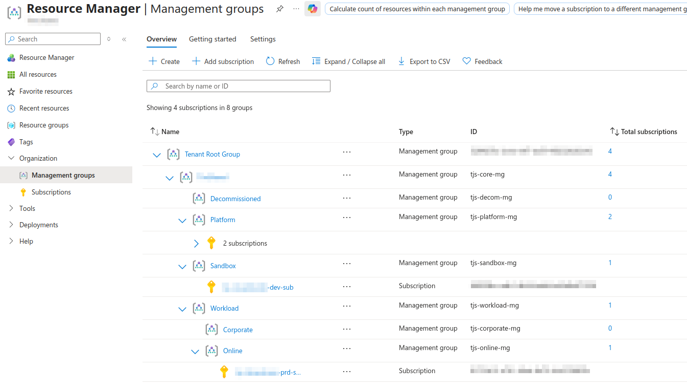
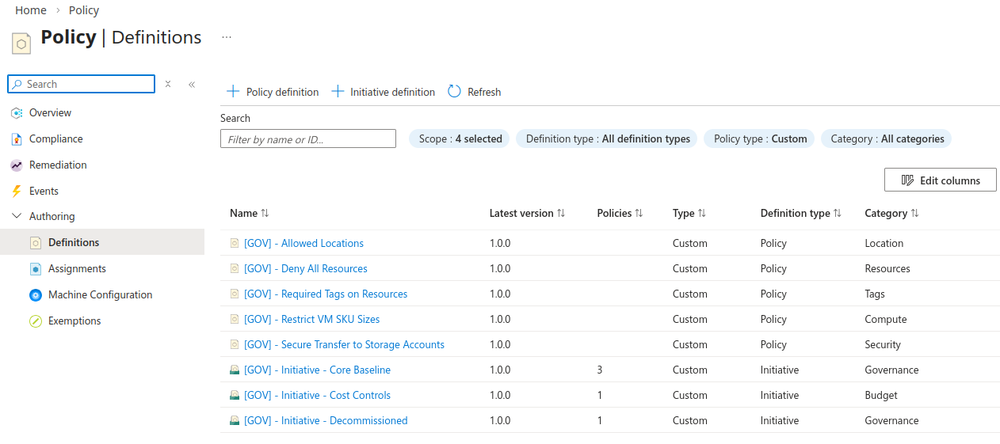

# Azure: Platform Landing Zone (Governance Stack)

This stack deploys the Governance layer for a custom, light-weight, CAF-aligned platform landing zone in Azure. 

## 🌟 Features

### Management Groups

- Create top-level (core) Management Group representing the organisation. 
- Deploy semi-opinionated Management Group structure defined within the `plz-governance.tfvars` file, allowing for expansion. 
- Management Groups are assigned to a "Level", determining the layer of depth at which each Management Group sits (parent/child). 
- Levels 2 and below are assigned to a parent Management Groups from Level 1 based on provided Management Group name. 
- Automated subscription assignments using name value identifiers. 

### Policy Definitions and Initiatives

- Policy Definitions are defined in JSON files within the `policy_definitions` directory. 
- Policy Initiatives are defined in JSON files within the `policy_initiatives` directory.  
- Policy Initiative Assignments are mapped to Management Groups using the `policy_initiatives` field in the Management Group structure. 
- Built-in Policy Initiatives are resolved by ID and assigned to target Management Groups in the `policy_initiatives_builtin` variable. 

## 📁 Example Structure

**Management Group Structure, Subscription Assignments, Policy Mapping**  

```hcl
# Management Group Structure. 
management_groups_level1 = {
  "platform" = {
    display_name             = "Platform"                               # Contains all platform subscriptions (management, connectivity, security and identity). 
    subscription_identifiers = ["platform-iac-sub", "platform-plz-sub"] # List of subscription name identifiers. Maps MG to sub associations keeping sub ID out of code.
    policy_initiatives       = ["core_baseline"]                        # Assign Policy Initiatives directly to MGs. 
  }
  "workload" = {
    display_name             = "Workload"                 # Contains the landing zone child management groups for workloads. 
    subscription_identifiers = ["visualstudio-dev-sub"]   # List of subscription name identifiers. Maps MG to sub associations keeping sub ID out of code.
    policy_initiatives       = ["cost_controls"]          # Assign Policy Initiatives directly to MGs. 
  }
}
```





---

## ▶️ Usage

1. Review and populate variables defined in the `./variables/plz-governance.tfvars` file. 
2. Update Management Group naming if required. **DO NOT** edit the key structure as this is opinionated and will break deployments. 
3. Ensure that desired parameters for policy assignments are configured in `policy_param_*` variables. 
4. Run the stack workflow from within GitHub Actions. 

---

<!-- BEGIN_TF_DOCS -->
## Providers

| Name | Version |
|------|---------|
| <a name="provider_azuread"></a> [azuread](#provider\_azuread) | 3.7.0 |
| <a name="provider_azurerm"></a> [azurerm](#provider\_azurerm) | 4.57.0 |
| <a name="provider_azurerm.iac"></a> [azurerm.iac](#provider\_azurerm.iac) | 4.57.0 |

## Modules

| Name | Source | Version |
|------|--------|---------|
| <a name="module_naming_mg"></a> [naming\_mg](#module\_naming\_mg) | ../../modules/global-resource-naming | n/a |

## Resources

| Name | Type |
|------|------|
| [azurerm_app_configuration_key.mg_core_id](https://registry.terraform.io/providers/hashicorp/azurerm/latest/docs/resources/app_configuration_key) | resource |
| [azurerm_app_configuration_key.mg_core_name](https://registry.terraform.io/providers/hashicorp/azurerm/latest/docs/resources/app_configuration_key) | resource |
| [azurerm_management_group.core](https://registry.terraform.io/providers/hashicorp/azurerm/latest/docs/resources/management_group) | resource |
| [azurerm_management_group.level1](https://registry.terraform.io/providers/hashicorp/azurerm/latest/docs/resources/management_group) | resource |
| [azurerm_management_group.level2](https://registry.terraform.io/providers/hashicorp/azurerm/latest/docs/resources/management_group) | resource |
| [azurerm_management_group.level3](https://registry.terraform.io/providers/hashicorp/azurerm/latest/docs/resources/management_group) | resource |
| [azurerm_management_group_policy_set_definition.custom](https://registry.terraform.io/providers/hashicorp/azurerm/latest/docs/resources/management_group_policy_set_definition) | resource |
| [azurerm_policy_definition.custom](https://registry.terraform.io/providers/hashicorp/azurerm/latest/docs/resources/policy_definition) | resource |

## Inputs

| Name | Description | Type | Default | Required |
|------|-------------|------|---------|:--------:|
| <a name="input_global"></a> [global](#input\_global) | Map of global variables used across multiple deployment stacks. | `map(map(string))` | `{}` | no |
| <a name="input_global_outputs"></a> [global\_outputs](#input\_global\_outputs) | Map of Shared Service key names, used to get IDs and names in data calls. | `map(string)` | n/a | yes |
| <a name="input_global_outputs_name"></a> [global\_outputs\_name](#input\_global\_outputs\_name) | Name of global outputs shared service App Configuration created during bootstrap. | `string` | n/a | yes |
| <a name="input_global_outputs_rg"></a> [global\_outputs\_rg](#input\_global\_outputs\_rg) | Map of global outputs shared service Resource Group for App Configuration created during bootstrap. | `string` | n/a | yes |
| <a name="input_management_group_core"></a> [management\_group\_core](#input\_management\_group\_core) | Map of top-level Management Group object, placed under tenant root. | <pre>map(object({<br/>    display_name       = string<br/>    policy_initiatives = optional(list(string)) # Assign Policy Initiatives directly to MGs. <br/>  }))</pre> | n/a | yes |
| <a name="input_management_groups_level1"></a> [management\_groups\_level1](#input\_management\_groups\_level1) | Map of first level Management Group objects, nested under the core Manangement Group. | <pre>map(object({<br/>    display_name             = string<br/>    parent_mg_name           = string<br/>    subscription_identifiers = optional(list(string)) # Optional list of subscription name identifier values. <br/>    policy_initiatives       = optional(list(string)) # Assign Policy Initiatives directly to MGs. <br/>  }))</pre> | n/a | yes |
| <a name="input_management_groups_level2"></a> [management\_groups\_level2](#input\_management\_groups\_level2) | Map of second level Management Group objects, nested under defined parent Management Group. | <pre>map(object({<br/>    display_name             = string<br/>    parent_mg_name           = string<br/>    subscription_identifiers = optional(list(string)) # Optional list of subscription name identifier values.  <br/>    policy_initiatives       = optional(list(string)) # Assign Policy Initiatives directly to MGs.<br/>  }))</pre> | n/a | yes |
| <a name="input_management_groups_level3"></a> [management\_groups\_level3](#input\_management\_groups\_level3) | Map of third level Management Group objects, nested under defined parent Management Group. | <pre>map(object({<br/>    display_name             = string<br/>    parent_mg_name           = string<br/>    subscription_identifiers = optional(list(string)) # Optional list of subscription name identifier values.<br/>    policy_initiatives       = optional(list(string)) # Assign Policy Initiatives directly to MGs.<br/>  }))</pre> | n/a | yes |
| <a name="input_policy_effect_mode"></a> [policy\_effect\_mode](#input\_policy\_effect\_mode) | String value to control the effect mode of policy assignments (audit, deployIfNotExists, disabled). | `string` | n/a | yes |
| <a name="input_policy_enforce_mode"></a> [policy\_enforce\_mode](#input\_policy\_enforce\_mode) | True/false value to control the enforcement mode of policy assignments. | `bool` | n/a | yes |
| <a name="input_policy_initiatives_builtin"></a> [policy\_initiatives\_builtin](#input\_policy\_initiatives\_builtin) | Map of objects containing built-in policy initiatives and their configuration settings. | <pre>map(object({<br/>    definition_id    = string # ID of the initiative (4f5b1359-4f8e-4d7c-9733-ea47fcde891e). <br/>    assignment_mg_id = string # Management Group ID to assign the initiative to. <br/>    enabled          = bool   # [true/false]: Toggle assignment.  <br/>    enforce          = bool   # [true/false]: Toggle enforcement of policy initiative. <br/>  }))</pre> | n/a | yes |
| <a name="input_policy_param_allowed_locations"></a> [policy\_param\_allowed\_locations](#input\_policy\_param\_allowed\_locations) | List of allowed locations for resources in string format. | `list(string)` | n/a | yes |
| <a name="input_policy_param_allowed_vm_skus"></a> [policy\_param\_allowed\_vm\_skus](#input\_policy\_param\_allowed\_vm\_skus) | List of allowed SKUs when deploying VMs. | `list(string)` | n/a | yes |
| <a name="input_policy_param_required_tags"></a> [policy\_param\_required\_tags](#input\_policy\_param\_required\_tags) | List of required tags to be assigned to resources in string format. | `list(string)` | n/a | yes |
| <a name="input_stack"></a> [stack](#input\_stack) | Map of stack specific variables for use within current deployment. | `map(map(string))` | `{}` | no |
| <a name="input_subscription_id"></a> [subscription\_id](#input\_subscription\_id) | Subscription ID for the stack resources. | `string` | n/a | yes |
| <a name="input_subscription_id_iac"></a> [subscription\_id\_iac](#input\_subscription\_id\_iac) | Subscription ID of the dedicated IaC subscription. | `string` | n/a | yes |

## Outputs

| Name | Description |
|------|-------------|
| <a name="output_management_groups_all"></a> [management\_groups\_all](#output\_management\_groups\_all) | Full details of created Management Groups. |
| <a name="output_policy_definitions"></a> [policy\_definitions](#output\_policy\_definitions) | Map of custom policy definitions. |
| <a name="output_policy_initiatives"></a> [policy\_initiatives](#output\_policy\_initiatives) | Map of custom policy initiatives. |
<!-- END_TF_DOCS -->
