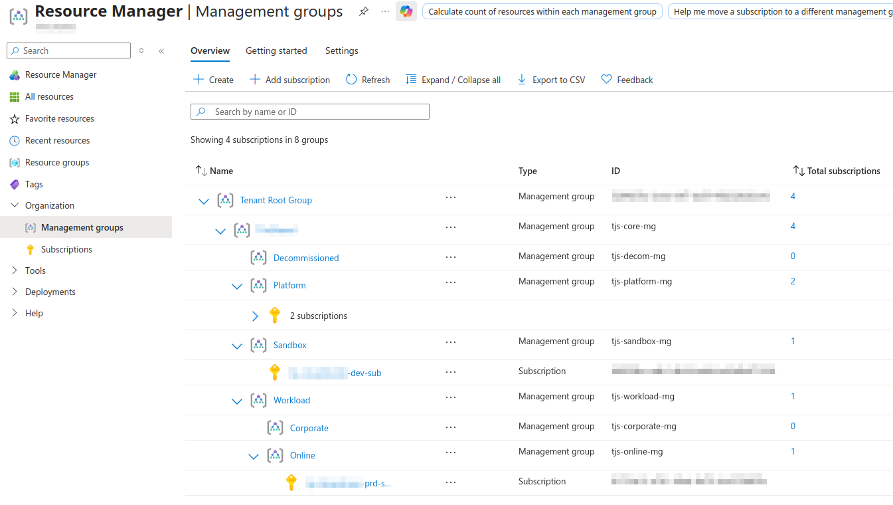
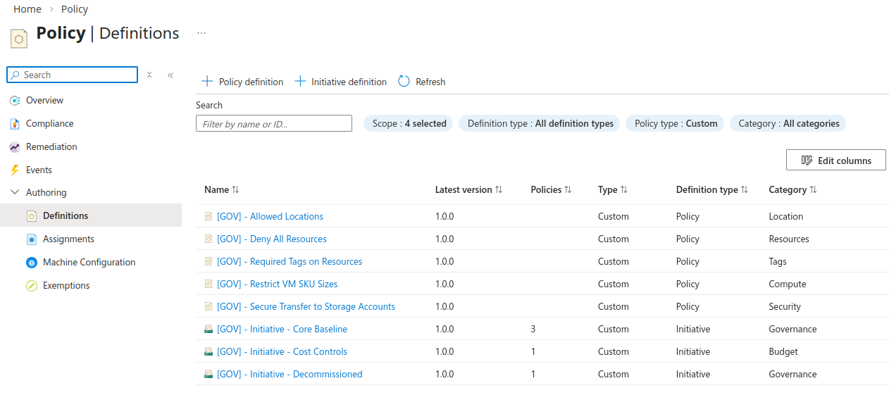

# Azure: Platform Landing Zone (Governance Stack)

This stack deploys the Governance layer for a custom, light-weight, CAF-aligned platform landing zone in Azure.

## ✨ Features

### Management Groups

- Create top-level (core) Management Group representing the organisation.
- Deploy semi-opinionated Management Group structure defined within the `plz-governance.tfvars` file, allowing for expansion.
- Management Groups are assigned to a "Level", determining the layer of depth at which each Management Group sits (parent/child).
- Levels 2 and below are assigned to a parent Management Groups from Level 1 based on provided Management Group name.
- Automated subscription assignments using name value identifiers.

### Policy Definitions and Initiatives

- Policy Definitions are defined in JSON files within the `policy_definitions` directory.
- Policy Initiatives are defined in JSON files within the `policy_initiatives` directory.  
- Policy Initiative Assignments are mapped to Management Groups using the `policy_initiatives` field in the Management Group structure.
- Built-in Policy Initiatives are resolved by ID and assigned to target Management Groups in the `policy_initiatives_builtin` variable.

## 📁 Example Structure

**Management Group Structure, Subscription Assignments, Policy Mapping**  

```hcl
# Management Group Structure. 
management_groups_level1 = {
  "platform" = {
    display_name             = "Platform"                               # Contains all platform subscriptions (management, connectivity, security and identity). 
    subscription_identifiers = ["platform-iac-sub", "platform-plz-sub"] # List of subscription name identifiers. Maps MG to sub associations keeping sub ID out of code.
    policy_initiatives       = ["core_baseline"]                        # Assign Policy Initiatives directly to MGs. 
  }
  "workload" = {
    display_name             = "Workload"                 # Contains the landing zone child management groups for workloads. 
    subscription_identifiers = ["visualstudio-dev-sub"]   # List of subscription name identifiers. Maps MG to sub associations keeping sub ID out of code.
    policy_initiatives       = ["cost_controls"]          # Assign Policy Initiatives directly to MGs. 
  }
}
```





---

## ▶️ Usage

> [!WARNING]
> Changing the key structure will break deployments as this is opinionated format.

1. Review and populate variables defined in the `./variables/plz-governance.tfvars` file.
2. Update Management Group naming if required.
3. Ensure that desired parameters for policy assignments are configured in `policy_param_*` variables.
4. Run the stack workflow from within GitHub Actions.

---
